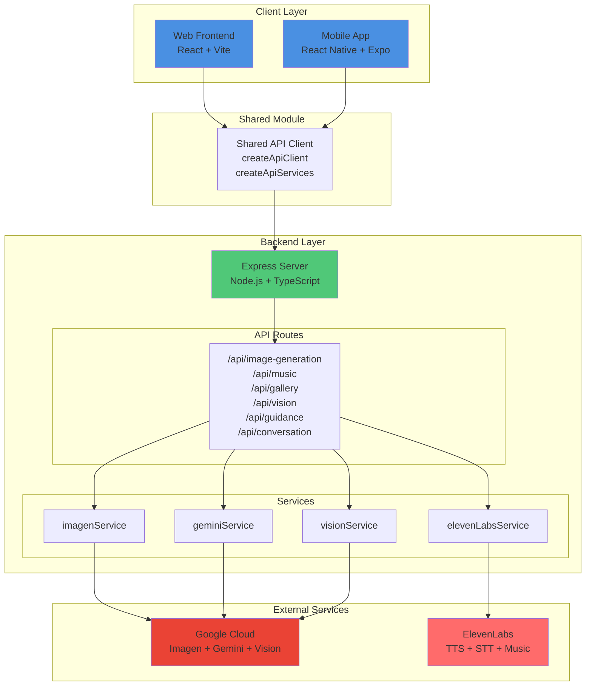
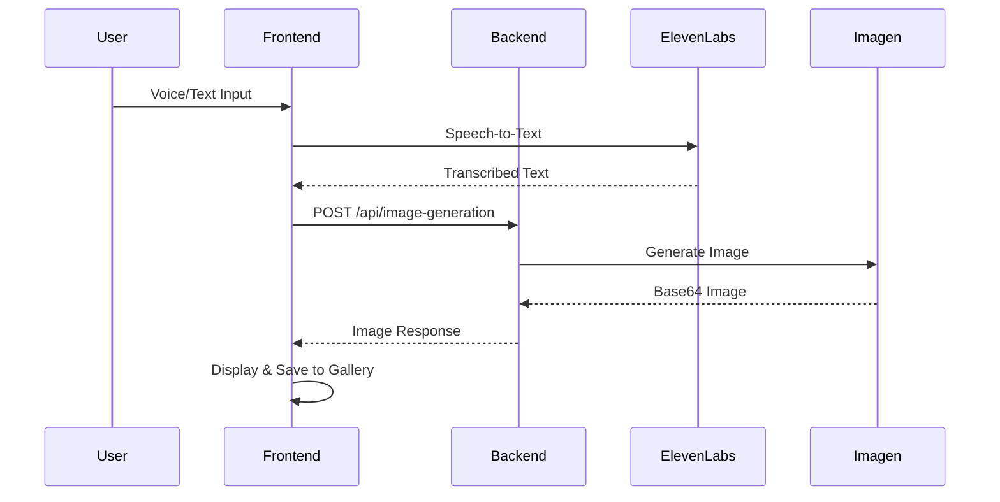
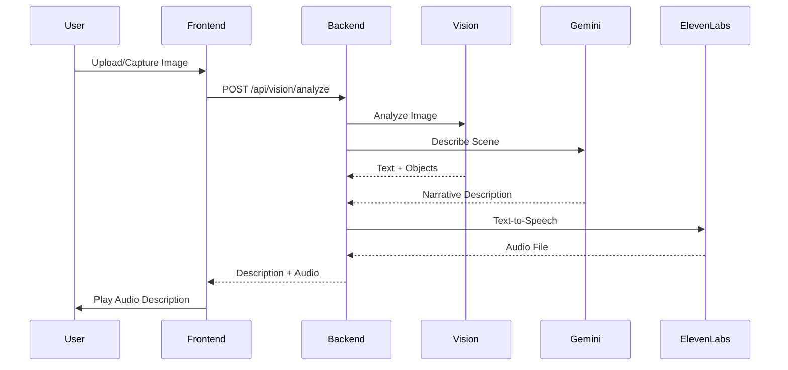
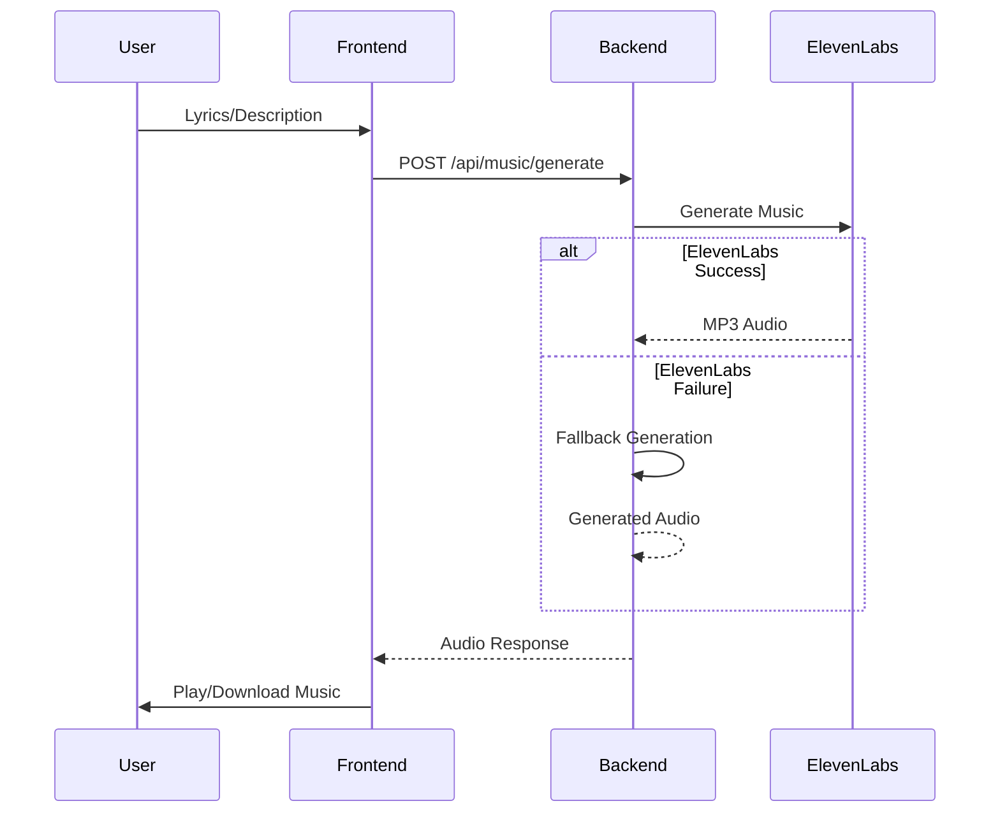
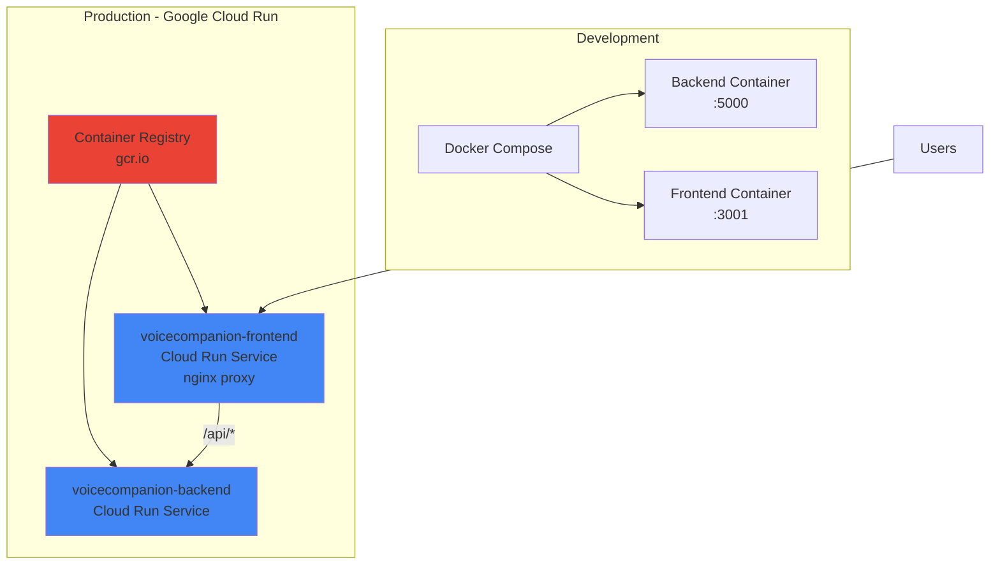

# VoiceCompanion

**VoiceCompanion** - An intelligent, voice-driven assistant that combines accessibility support for visually impaired users with immersive language learning capabilities and creative AI features. Built with ElevenLabs for natural voice interaction, Google Cloud Gemini for intelligent understanding, and Google Imagen for image generation.

## Table of Contents

- [Overview](#overview)
- [Features](#features)
- [Architecture](#architecture)
- [Tech Stack](#tech-stack)
- [Quick Start](#quick-start)
- [Project Structure](#project-structure)
- [API Endpoints](#api-endpoints)
- [Deployment](#deployment)
- [Troubleshooting](#troubleshooting)

## Overview

VoiceCompanion is a unified platform offering multiple powerful features:

### 🎨 Voice to Art
- **Text-to-Image Generation**: Convert voice or text descriptions into beautiful artwork using Google Imagen
- **Style Selection**: Choose from various artistic styles (realistic, artistic, abstract, etc.)
- **Gallery Management**: Save, organize, and manage your generated artwork
- **Voice Input**: Describe your art using natural voice commands

### 📸 Image to Voice
- **Scene Description**: Get detailed, narrative descriptions of images
- **Voice Narration**: Listen to image descriptions in natural voice
- **Multiple Input Methods**: Upload images, use camera, or select from gallery
- **Accessibility Focus**: Designed for visually impaired users

### 🎵 Script to Music
- **Music Generation**: Convert lyrics or text descriptions into music using ElevenLabs Music API
- **Style Selection**: Choose from acoustic, electronic, classical, jazz, rock, or ambient styles
- **Customizable Length**: Set music duration (30 seconds to 10 minutes)
- **Voice Input**: Describe the music you want using voice commands
- **Fallback Support**: Open-source music generation when ElevenLabs is unavailable

### 🧭 Real-Time Guidance
- **Navigation Assistance**: Continuous voice guidance for safe navigation
- **Hazard Detection**: Identify and warn about obstacles and hazards
- **Simulation Mode**: Practice with sample navigation scenarios
- **Context-Aware**: Maintains context across frames for better guidance

### 🛒 Voice Guided Shopping
- **Product Identification**: Identify products and read labels
- **Shopping Assistance**: Get help comparing items and finding products
- **Voice Interaction**: Ask questions about products using natural language
- **Simulation Mode**: Practice shopping scenarios

### 👁️ Accessibility Mode
- **Visual Assistance**: Camera-based scene description and object identification
- **Document Reading**: Read letters, bills, recipes, and instructions aloud
- **Shopping Support**: Identify products, read labels, and compare items
- **Navigation Help**: Voice-guided directions and location descriptions
- **Daily Living**: Task management and daily assistance
- **Accessibility Toggle**: Enable voice descriptions of UI elements

### 📚 Language Learning Mode
- **Conversation Practice**: Natural voice interaction in target languages
- **Intelligent Feedback**: Real-time grammar, vocabulary, and pronunciation analysis
- **Cultural Context**: Learn idioms, formality levels, and cultural nuances
- **Personalized Learning**: Adaptive difficulty that adjusts to your skill level
- **Progress Tracking**: Detailed analytics and learning recommendations

## Features

- **Natural Voice Interaction**: Entirely voice-driven using ElevenLabs for lifelike, conversational voice synthesis
- **Multimodal AI**: Combines voice and visual inputs for intelligent understanding
- **Intelligent Understanding**: Google Cloud Gemini powers contextual understanding and helpful responses
- **Image Generation**: Google Imagen for high-quality text-to-image generation
- **Music Generation**: ElevenLabs Music API for converting text/lyrics to music with fallback support
- **Accessible by Design**: High contrast mode, keyboard navigation, and screen reader support
- **Real-Time Feedback**: Immediate corrections and suggestions for language learners
- **Progress Tracking**: Monitor improvement with detailed analytics
- **Gallery Management**: Save and organize generated artwork (cross-platform sync)
- **Cross-Platform**: Web and mobile (iOS & Android) support with shared codebase

## Architecture

### System Architecture



### Data Flow Diagrams

#### Voice to Art Flow



#### Image to Voice Flow



#### Script to Music Flow



### Deployment Architecture



## Tech Stack

### Frontend
- **React 18+**: UI framework
- **TypeScript**: Type safety
- **Vite**: Build tool and dev server
- **React Router**: Client-side routing
- **CSS Modules**: Component styling

### Mobile
- **React Native**: Mobile framework
- **Expo**: Development platform
- **React Navigation**: Navigation library
- **Expo AV**: Audio/video playback
- **Expo Image Picker**: Image selection
- **Expo Media Library**: Gallery access
- **Expo Speech**: Text-to-speech

### Backend
- **Node.js**: Runtime
- **Express**: Web framework
- **TypeScript**: Type safety
- **Axios**: HTTP client
- **CORS**: Cross-origin support

### Shared Module
- **Axios**: HTTP client
- **TypeScript**: Shared types
- **Common API**: Unified interface for web and mobile

### External Services
- **ElevenLabs**: Voice synthesis, speech-to-text, music generation
- **Google Cloud Gemini**: AI understanding and generation
- **Google Imagen**: Image generation (Vertex AI)
- **Google Vision API**: Image analysis

### Deployment
- **Docker Compose**: Development environment
- **Google Cloud Run**: Production deployment (separate frontend/backend services)
- **Container Registry (GCR)**: Docker image storage
- **Nginx**: Frontend static file serving and API proxying

## Quick Start

### Prerequisites

- Node.js 18+ and npm
- Docker and Docker Compose (for development)
- ElevenLabs API key (with Music API access for music generation)
- Google Cloud Gemini API key
- Google Cloud project with:
  - Vertex AI API enabled
  - Imagen API enabled (requires billing)
  - Vision API enabled (optional)
  - Application Default Credentials configured

### 1. Clone the Repository

```bash
git clone <repository-url>
cd AI-Partner
```

### 2. Configure Environment Variables

Create a `.env` file in the root directory:

```env
# Required
ELEVENLABS_API_KEY=your_elevenlabs_api_key
GEMINI_API_KEY=your_gemini_api_key
PORT=5000
NODE_ENV=development

# Google Cloud (for Imagen and Vision)
GOOGLE_CLOUD_PROJECT_ID=your_project_id
VERTEX_AI_LOCATION=us-central1

# Optional
GOOGLE_APPLICATION_CREDENTIALS=/root/.config/gcloud/application_default_credentials.json
```

### 3. Set Up Google Cloud Credentials

```bash
# Login with Application Default Credentials
gcloud auth application-default login

# Set quota project
gcloud auth application-default set-quota-project your_project_id

# Enable required APIs
gcloud services enable aiplatform.googleapis.com
gcloud services enable vision.googleapis.com
```

### 4. Run with Docker Compose (Recommended)

```bash
# Start all services
docker compose -f docker-compose.dev.yml up

# Or run in background
docker compose -f docker-compose.dev.yml up -d
```

The application will be available at:
- Frontend: http://localhost:3001
- Backend: http://localhost:5000

### 5. Run Mobile App (Optional)

```bash
cd mobile
npm install
npm start
```

Then:
- Press `i` for iOS Simulator
- Press `a` for Android Emulator
- Scan QR code with Expo Go app on your phone

See [mobile/MOBILE_SETUP.md](mobile/MOBILE_SETUP.md) for detailed mobile setup instructions.

## Project Structure

```
AI-Partner/
├── frontend/              # React web frontend
│   ├── src/
│   │   ├── components/    # UI components
│   │   │   ├── VoiceToArt.tsx
│   │   │   ├── ImageToVoice.tsx
│   │   │   ├── ScriptToMusic.tsx
│   │   │   ├── RealTimeGuidance.tsx
│   │   │   ├── VoiceGuidedShopping.tsx
│   │   │   └── ...
│   │   ├── hooks/         # Custom React hooks
│   │   ├── contexts/      # React contexts (VoiceMode)
│   │   └── services/      # API services
│   ├── Dockerfile.cloudrun
│   └── nginx.cloudrun.conf
├── mobile/                # React Native mobile app
│   ├── src/
│   │   ├── screens/       # Screen components
│   │   │   ├── VoiceToImageScreen.tsx
│   │   │   ├── ImageToVoiceScreen.tsx
│   │   │   ├── BlindGuidanceScreen.tsx
│   │   │   └── ...
│   │   ├── components/    # Reusable components
│   │   ├── hooks/         # Custom hooks
│   │   ├── contexts/      # React contexts
│   │   └── services/      # API services
├── backend/               # Express backend
│   ├── src/
│   │   ├── routes/        # API routes
│   │   │   ├── imageGeneration.ts
│   │   │   ├── music.ts
│   │   │   ├── gallery.ts
│   │   │   ├── vision.ts
│   │   │   └── ...
│   │   ├── services/      # Business logic
│   │   │   ├── imagenService.ts
│   │   │   ├── elevenLabsService.ts
│   │   │   ├── geminiService.ts
│   │   │   └── ...
│   │   └── __tests__/     # Unit tests
│   └── Dockerfile
├── shared/                # Shared code between web and mobile
│   ├── src/
│   │   ├── api.ts         # Common API client
│   │   └── types.ts        # Shared TypeScript types
├── gcp/                   # Google Cloud deployment scripts
│   ├── cloudbuild.yaml
│   ├── deploy-to-cloudrun.sh
│   └── ...
└── README.md
```

## API Endpoints

### Image Generation
- `POST /api/image-generation/generate` - Generate image from text/voice prompt

### Speech to Text
- `POST /api/speech-to-text/transcribe` - Transcribe audio to text

### Text to Speech
- `POST /api/text-to-speech/generate` - Generate speech from text

### Vision
- `POST /api/vision/analyze` - Analyze image (text + objects + description)
- `POST /api/vision/text` - Extract text from image

### Music Generation
- `POST /api/music/generate` - Generate music from text/lyrics

### Gallery
- `POST /api/gallery/save` - Save artwork to gallery
- `GET /api/gallery/list` - List all saved artwork
- `DELETE /api/gallery/:id` - Delete artwork

### Guidance
- `POST /api/guidance/realtime` - Get real-time navigation guidance

### Conversation
- `POST /api/conversation` - Send a message and get AI response (supports both modes)

### Daily Living (Accessibility Mode)
- `POST /api/daily-living/read-document` - Read and explain documents
- `POST /api/daily-living/shopping-assist` - Shopping assistance
- `POST /api/daily-living/navigation` - Navigation help
- `POST /api/daily-living/tasks` - Task management

### Feedback (Learning Mode)
- `POST /api/feedback/analyze` - Analyze text for language learning feedback

### Progress (Learning Mode)
- `GET /api/progress` - Get user progress
- `POST /api/progress` - Update progress

### Language (Learning Mode)
- `POST /api/language/analyze` - Language analysis
- `POST /api/language/cultural` - Cultural context

### Personalization (Learning Mode)
- `GET /api/personalization/skill-level` - Skill assessment
- `GET /api/personalization/difficulty` - Adaptive difficulty
- `GET /api/personalization/recommendations` - Learning recommendations

**API Documentation**: Access Swagger UI at `/docs` when backend is running.

## Deployment

### Google Cloud Run Deployment

**Quick deployment:**
```bash
# Build and push images
./gcp/build-and-push-local.sh

# Deploy services
./gcp/deploy-to-cloudrun.sh
```

**Service management:**
```bash
# List services
./gcp/list-services.sh

# Delete old revisions
./gcp/delete-old-revisions.sh

# Cleanup unused resources
./gcp/cleanup-unused.sh
```

**Architecture:**
- **Backend**: Deployed as `voicecompanion-backend` service (port 5000)
- **Frontend**: Deployed as `voicecompanion-frontend` service (port 8080, nginx)
- **Proxy**: Frontend nginx proxies `/api/*` requests to backend
- **Container Registry**: Uses GCR (`gcr.io/PROJECT_ID/...`)
- **Environment Variables**: `BACKEND_URL` and `BACKEND_HOST` set for frontend nginx

For detailed deployment instructions, see [gcp/README.md](gcp/README.md).

## Troubleshooting

### Image Generation Issues
- Ensure Google Cloud billing is enabled
- Verify Vertex AI API is enabled
- Check Imagen API access in your project
- Verify Application Default Credentials are set up

### Music Generation Issues
- Music API requires a paid ElevenLabs subscription
- Check your ElevenLabs plan includes Music Generation access
- Verify API key is valid and has Music API permissions
- Falls back to open-source music generation if ElevenLabs fails

### Voice Recognition Issues
- Check microphone permissions
- Ensure browser supports Web Speech API
- For mobile, check app permissions in settings

### Cloud Run Deployment Issues
- **502 Bad Gateway**: Check `BACKEND_URL` and `BACKEND_HOST` environment variables
- **404 on API routes**: Verify nginx proxy configuration
- **Container startup failures**: Check startup logs and environment variables
- Run diagnostic scripts: `./gcp/diagnose-502.sh` or `./gcp/test-api-proxy.sh`

### Mobile App Issues
- See [mobile/TROUBLESHOOTING.md](mobile/TROUBLESHOOTING.md) for mobile-specific issues
- Clear Metro cache: `npx expo start --clear`
- Rebuild development build if needed

## Key Features Implementation

### ElevenLabs Integration
- **Text-to-Speech API**: Natural voice responses
- **Speech-to-Text API**: Voice input transcription
- **Music Generation API**: Convert text/lyrics to music (requires paid subscription)
- **Fallback Support**: Open-source music generation when ElevenLabs is unavailable
- Real-time audio playback

### Google Cloud Gemini Integration
- Language analysis for grammar, vocabulary, and pronunciation
- Cultural context explanations
- Multimodal understanding (text + images)
- Narrative image descriptions
- Adaptive response generation

### Google Imagen Integration
- High-quality text-to-image generation
- Multiple style options
- Safety filters and content moderation
- Person generation controls

### Google Cloud Vision API
- Text extraction from images
- Object detection and identification
- Scene analysis
- Label detection

### Shared Module
- Common API client for web and mobile
- Shared TypeScript types
- Reduces code duplication
- Ensures consistency across platforms

## Demo Scenarios

### Voice to Art
1. **"A serene mountain landscape at sunset"** - Generate beautiful artwork
2. **"Abstract geometric patterns in blue and gold"** - Create artistic images
3. **"A cozy coffee shop interior"** - Generate realistic scenes

### Image to Voice
1. **Upload a photo** - Get detailed narrative description
2. **Use camera** - Real-time scene description
3. **Select from gallery** - Describe saved artwork

### Script to Music
1. **Enter lyrics** - Convert to music in selected style
2. **Describe music** - "A relaxing acoustic guitar melody"
3. **Generate and play** - Listen to generated music

### Accessibility Mode
1. **"What do you see?"** - Real-time scene description
2. **"Read this"** - Document and text reading
3. **Shopping Assistance** - Product identification and label reading
4. **Navigation** - Voice-guided directions

### Learning Mode
1. **Restaurant Ordering** - Practice ordering food
2. **Travel & Directions** - Learn travel vocabulary
3. **Job Interview** - Prepare for interviews
4. **Casual Conversation** - Practice everyday language

## Competitive Advantages

1. **Multi-Purpose Platform**: Combines accessibility, learning, and creative AI in one platform
2. **Fully Voice-Driven**: No typing required - pure conversation
3. **Multimodal AI**: Combines voice and visual inputs
4. **Real-Time Feedback**: Immediate corrections and suggestions
5. **Personalized**: Adapts to individual needs and skill levels
6. **Accessible**: Built for users with visual impairments
7. **Creative Tools**: Image and music generation capabilities
8. **Cross-Platform**: Web and mobile support with shared codebase

## Future Enhancements

- Full ElevenLabs Agents SDK integration with streaming
- Multi-language support for accessibility mode
- Advanced pronunciation analysis with audio processing
- Offline mode for basic features
- Integration with smart home devices
- Enhanced gallery with sharing capabilities
- Music style customization and fine-tuning
- Real-time collaboration features
- Advanced accessibility features (haptic feedback, etc.)
- Persistent storage (Firestore/PostgreSQL) for gallery and user data

## License

MIT

## Acknowledgments

- ElevenLabs for voice synthesis and music generation technology
- Google Cloud for AI, vision, and image generation capabilities
- Built for accessibility, inclusion, learning, and creativity
